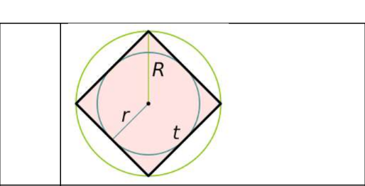
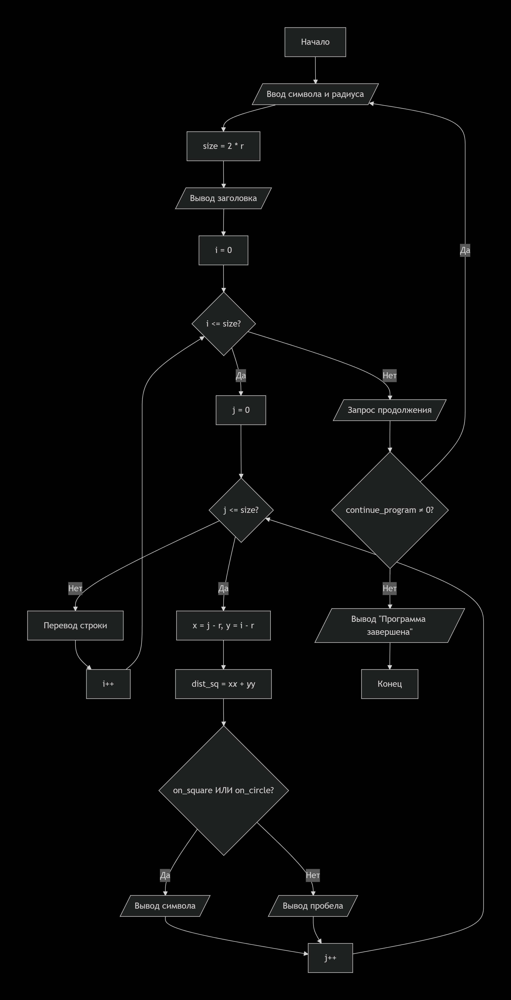
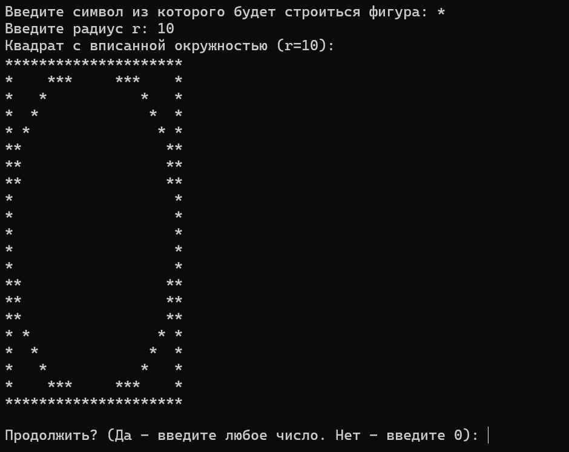

# Домашняя работа к лабораторной работе 9.
## Условия задачи:
Написать программу, выводящую на экран заданную геометрическую фигуру, нарисованную с помощью заданного с клавиатуры символа. Предусмотреть возможность изменения размеров фигуры путем задания ее размеров в количестве символов пользователем: 
## 1. Алгоритм и блок схема:
### Алгоритм:
1. **Начало**
2. Объявить переменные:
 	- `symbol` — символ из которого состоит фигура
	- `r` — радиус
	- `c` — промежуточное вычисление
  	- `d` — промежуточное вычисление
   	- `e` — итоговое вычисление
  	- `x` — входное число
    - `y` — -1.625 * pow(10, 3)
   	- `z` — 0.512
3. Ввод переменных:
   - Ввод переменной: `x`
4. Вычислить:
   - `a` = exp(`x` - 1 / sin(`z`))
   - `b` = pow(`a`, 1.0 / 3.0)
   - `c` = sqrt(`x` + pow(fabs(`y`), 1.0 / 4.0))
   - `d` = pow(2, -`x`)
   - `e` = `b` * `c` * `d`
5. Вывести результаты расчётов с подстановкой значений в текст.
6. **Конец**

### Блок схема

## 2. Реализация программы:
```
#define _CRT_SECURE_NO_DEPRECATE
#include <locale.h>
#include <stdio.h>
#include <stdlib.h>

void main()
{
    setlocale(LC_ALL, "");
    int continue_program;

    do {
        char symbol;
        int r;
        int i, j;
        int size;

        printf("Введите символ из которого будет строиться фигура: ");
        scanf(" %c", &symbol);

        printf("Введите радиус r: ");
        scanf("%d", &r);

        size = 2 * r;

        printf("Квадрат с вписанной окружностью (r=%d):\n", r);

        for (i = 0; i <= size; i++)
        {
            for (j = 0; j <= size; j++)
            {
                int x = j - r;
                int y = i - r;

                int dist_sq = x * x + y * y;

                int on_square = (i == 0 || i == size || j == 0 || j == size);

                int on_circle = (dist_sq >= r * r - r && dist_sq <= r * r + r);

                if (on_square || on_circle) {
                    printf("%c", symbol);
                }
                else {
                    printf(" ");
                }
            }
            printf("\n");
        }

        printf("\nПродолжить? (Да - введите любое число. Нет - введите 0): ");
        scanf("%d", &continue_program);
        printf("\n");

    } while (continue_program != 0);

    printf("Программа завершена.\n");
    system("pause");
}
```
## 3. Результат работы программы

## 4. Информация о разработчике
Капичников Юрий, бИПТ-252
